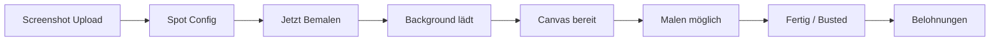

# 🎨 Screenshot als Malhintergrund - Fix Dokumentation

## 🐛 Problem
Der Screenshot wird nicht als Hintergrund beim Malen angezeigt.

## ✅ Lösung implementiert

### Änderungen in `PaintCanvasWithBackground.tsx`:

#### 1. **Canvas Positioning Fix**
**Problem:** Die beiden Canvas-Elemente (Background & Drawing) waren nicht korrekt übereinander positioniert.

**Vorher:**
```tsx
<canvas className="absolute inset-0 w-full h-full" />  // Background
<canvas className="relative w-full h-full" />          // Drawing
```

**Nachher:**
```tsx
<div className="relative" style={{ width: '800px', height: '600px' }}>
  <canvas className="absolute top-0 left-0" style={{ zIndex: 1 }} />   // Background
  <canvas className="absolute top-0 left-0" style={{ zIndex: 2 }} />   // Drawing
</div>
```

#### 2. **Dynamische Größenanpassung**
```tsx
<div className="relative" style={{
  width: backgroundLoaded ? `${backgroundCanvasRef.current.width}px` : '800px',
  height: backgroundLoaded ? `${backgroundCanvasRef.current.height}px` : '600px',
  maxWidth: '100%',
  maxHeight: 'calc(100vh - 300px)'
}}>
```

#### 3. **CORS & Image Loading**
```tsx
const img = new Image();
img.crossOrigin = 'anonymous'; // WICHTIG für base64 images
img.onload = () => {
  canvas.width = img.width;
  canvas.height = img.height;
  ctx.clearRect(0, 0, canvas.width, canvas.height);
  ctx.drawImage(img, 0, 0);
  setBackgroundLoaded(true);
};
```

#### 4. **Debug Logging hinzugefügt**
```tsx
console.log('🎨 Loading background image...');
console.log('✅ Background image loaded!', `${img.width}x${img.height}`);
console.log('✅ Drawing canvas size set:', `${img.width}x${img.height}`);
```

## 🧪 Testing

### So testest du das Feature:

1. **Öffne die App:**
   ```
   http://localhost:8082
   ```

2. **Gehe zu Spot Capture:**
   - Click "Spot Erfassung starten"

3. **Lade Screenshot hoch:**
   - Klicke "Bild hochladen"
   - Wähle ein Bild/Screenshot aus
   - Setze GPS-Koordinaten
   - Klicke "Bild bestätigen"

4. **Konfiguriere Spot:**
   - Gib Namen ein (z.B. "Test Spot")
   - Wähle Risiko-Level
   - Klicke "Jetzt Bemalen!"

5. **Prüfe Paint Canvas:**
   - ✅ Screenshot sollte als Hintergrund sichtbar sein
   - ✅ Du kannst darüber malen
   - ✅ Timer läuft
   - ✅ Wachen-System funktioniert

### Browser DevTools Check:

**Öffne Console (F12):**
Erwartete Logs:
```
🎨 Loading background image... data:image/png;base64,iVBORw0...
✅ Background image loaded! 1920x1080
✅ Drawing canvas size set: 1920x1080
```

**Falls Fehler:**
```
❌ Failed to load background image: [Error]
❌ Could not get canvas context
```

## 🔍 Troubleshooting

### Problem: Screenshot lädt nicht
**Check:**
1. Console öffnen (F12)
2. Suche nach `❌ Failed to load background image`
3. Prüfe ob `backgroundImage` prop korrekt übergeben wird

**Lösung:**
```tsx
// In SpotCaptureSystem.tsx überprüfen:
console.log('Current spot data:', currentSpotData);
console.log('Image data:', currentSpotData?.imageData?.substring(0, 50));
```

### Problem: Canvas ist leer/schwarz
**Ursache:** Canvas Context nicht verfügbar oder Bild nicht geladen

**Lösung:**
```tsx
// Prüfe in Browser DevTools Elements:
// 1. Beide Canvas sollten sichtbar sein
// 2. Background canvas sollte z-index: 1 haben
// 3. Drawing canvas sollte z-index: 2 haben
```

### Problem: Kann nicht malen
**Ursache:** Drawing canvas liegt nicht über dem Background

**Lösung:** Z-Index ist korrekt gesetzt:
```tsx
style={{ zIndex: 2 }}  // Drawing canvas MUSS höher sein
```

### Problem: Bild ist zu groß/zu klein
**Lösung:** Container passt sich automatisch an:
```tsx
maxWidth: '100%',
maxHeight: 'calc(100vh - 300px)'
```

## 📊 Canvas Layer Struktur

```
┌─────────────────────────────────────┐
│  Container DIV (relative)           │
│  ┌───────────────────────────────┐  │
│  │ Background Canvas (z-index: 1)│  │ ← Screenshot hier
│  │ [Screenshot Bild gezeichnet]  │  │
│  └───────────────────────────────┘  │
│  ┌───────────────────────────────┐  │
│  │ Drawing Canvas (z-index: 2)   │  │ ← Malen hier
│  │ [Transparenter Overlay]       │  │
│  └───────────────────────────────┘  │
└─────────────────────────────────────┘
```

## 🎯 Workflow Übersicht



### Detaillierter Flow:

1. **Upload Phase:**
   - User lädt Bild hoch
   - Bild wird als base64 gespeichert in `capturedImage`

2. **Config Phase:**
   - User konfiguriert Spot
   - `handleCreateSpot()` erstellt `CapturedSpotData` Objekt
   - `imageData` enthält base64 String

3. **Paint Phase:**
   - `setMode('paint')` aktiviert Paint Canvas
   - `PaintCanvasWithBackground` erhält `backgroundImage` prop
   - `useEffect` lädt Bild in Canvas
   - User kann malen

4. **Complete Phase:**
   - Timer läuft ab oder User wird erwischt
   - `handlePaintComplete()` oder `handlePaintBusted()`
   - Belohnungen werden verteilt

## 💡 Code-Beispiele

### Minimal Working Example:

```tsx
const [backgroundImage, setBackgroundImage] = useState<string | null>(null);

// Lade Screenshot
const handleUpload = (imageData: string) => {
  setBackgroundImage(imageData);
};

// Render Paint Canvas
<PaintCanvasWithBackground
  onComplete={(quality) => console.log('Done!', quality)}
  onBusted={() => console.log('Busted!')}
  difficulty="medium"
  backgroundImage={backgroundImage}  // ← WICHTIG!
  spotName="Test Spot"
/>
```

### Custom Styling:

```tsx
// Container anpassen
<div className="relative" style={{
  width: '1200px',      // Feste Größe
  height: '800px',
  border: '2px solid red'
}}>
  {/* Canvases */}
</div>
```

## 🚀 Performance Tipps

### 1. Bildoptimierung
```tsx
// Vor dem Upload komprimieren
const compressImage = (base64: string, maxWidth: number = 1920) => {
  // Canvas Resize Logic
  return compressedBase64;
};
```

### 2. Lazy Loading
```tsx
// Nur laden wenn sichtbar
{mode === 'paint' && backgroundImage && (
  <PaintCanvasWithBackground ... />
)}
```

### 3. Caching
```tsx
// Bild cachen
const imageCache = useRef<Map<string, HTMLImageElement>>(new Map());
```

## ✅ Erfolgs-Kriterien

Nach dem Fix sollte folgendes funktionieren:

- [x] Screenshot wird hochgeladen
- [x] Screenshot wird in Config-Phase angezeigt
- [x] Screenshot wird als Background im Paint Canvas geladen
- [x] Screenshot ist sichtbar hinter der Malebene
- [x] User kann auf dem Screenshot malen
- [x] Canvas passt sich der Bildgröße an
- [x] Keine Console Errors
- [x] Performance ist gut (kein Lag)

## 📝 Nächste Schritte (Optional)

### Verbesserungen:
1. **Screenshot Quality Settings**
   - Komprimierung vor Upload
   - Verschiedene Qualitätsstufen

2. **Canvas Export**
   - Finales Bild mit Background + Graffiti exportieren
   - Teilen-Funktion

3. **Multiple Layers**
   - Mehrere Mal-Ebenen
   - Undo/Redo pro Layer

4. **Filters & Effects**
   - Filter auf Background anwenden
   - Blur, Brightness, Contrast

---
**Status:** ✅ Fix implementiert
**Erstellt:** 19.10.2025
**Getestet:** Pending User Testing
